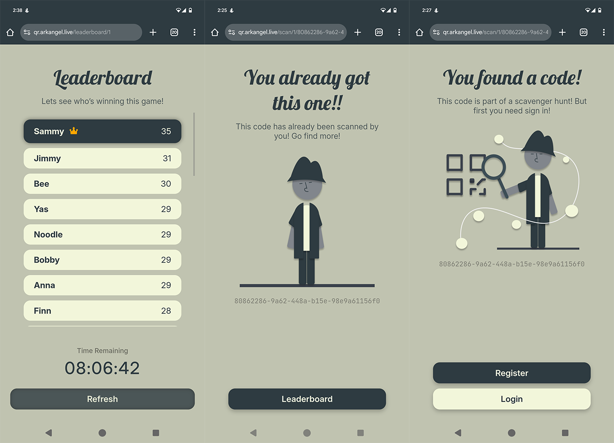

# QrHunt 🔎

This is a scavenger hunt game where you scan QR codes within a limited amount of time. It is implemented in Svelte for the front end and the backend is implemented with .NET 8 and uses Sqlite3 and EFCore for data persistence. 


## Getting started

The application is containerized and uses compose to orchestrate the stack creation. So to get an instance up and running run the following commands

```shell
git clone https://github.com/arkangel-dev/qr-hunt.git
cd qr-hunt
docker compose up -d
```


> ℹ️ But before spinning up the container you might want to update the JWT signing key. You can do so by editing `data/backend/appsettings.json`. More specifically you need to update the `Jwt:Key` key. If you do not perform this step, you risk someone using the default key in the repository to mess with your games


## Features

- Open Login / Registration
- Multi Game Support
- Multi Win Conditions
- Live leaderboard updates via websockets


## Screenshots

The color scheme and the overall feel of the UI was inspired by the TV show Loki. I went for a minimalistic and clean version of the 80/90s retro-futurism feel :D 



